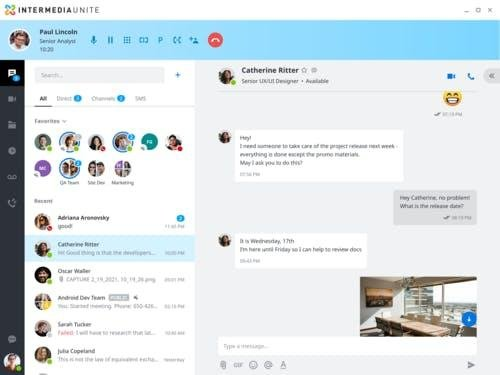
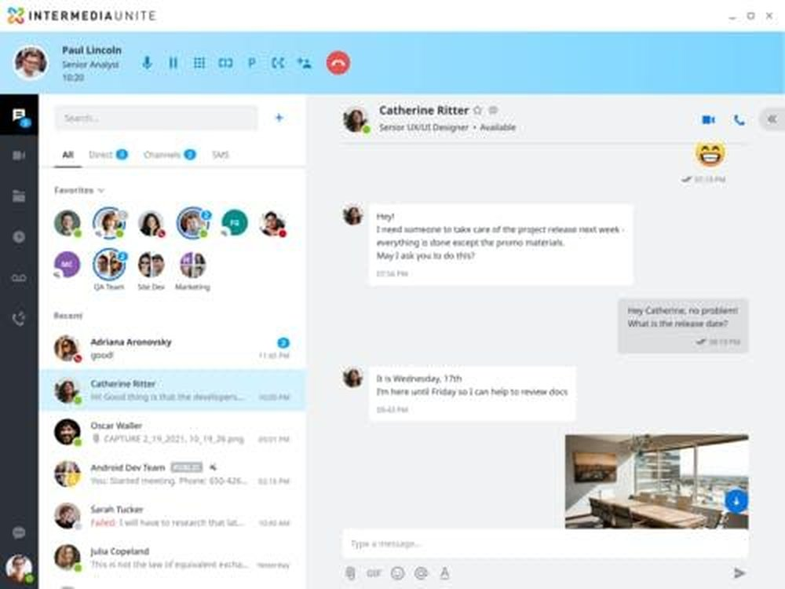
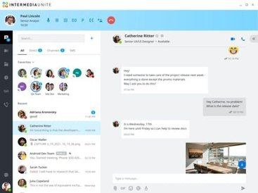
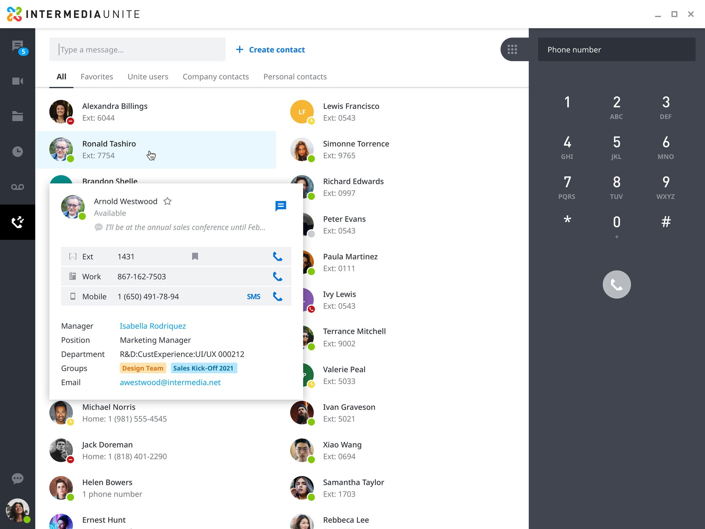
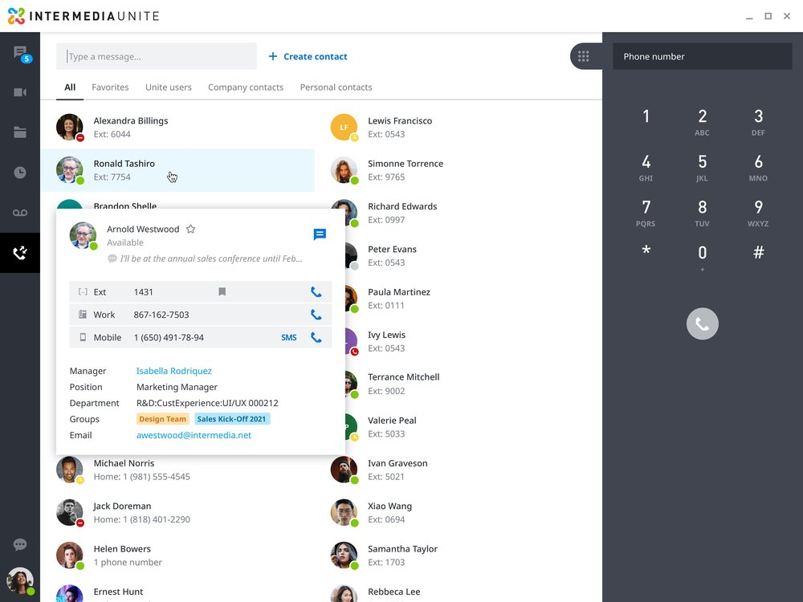
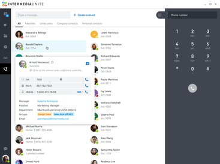

# Intermedia Unite

**Learn about Intermedia Unite.**

 

### 

[**Visit Intermedia Unite on SOFTGIT**](https://softgit.pro/p/intermedia-unite) · [Browse apps](https://softgit.pro)

---

## Overview

Learn about Intermedia Unite.

Learn about Intermedia Unite. Read Intermedia Unite reviews from real users, and view pricing and features of the Business VoIP software

## At a glance

- Category: Media
- Publisher / site: intermedia.com
- Listing tag: SaaS
- Official site (from listing): https://www.intermedia.com/products/unite
- Source listing: https://sourceforge.net/software/product/Intermedia/
- Type: Business / SaaS listing (information page)

## Screenshots

  
  
  
  
  
  

## System / listing information

| Field | Value |
|---|---|
| Name | Intermedia Unite |
| Category | Media |
| Publisher | intermedia.com |
| Platform | Web / see listing |
| License / offer | SaaS |
| Updated | October 6, 2026 |
| Listed package size | 1.1 MB |

## How to get started

1. Open the [Intermedia Unite page on SOFTGIT](https://softgit.pro/p/intermedia-unite).
2. Review the overview, screenshots, and any official website link on that page.
3. Use the page CTA to visit the vendor site or request access / trial as offered there.
4. This GitHub repo is an informational listing only — it does not host SaaS installers or account credentials.

[**Visit Intermedia Unite on SOFTGIT**](https://softgit.pro/p/intermedia-unite)

## FAQ

**What is this repository?**  
An unofficial information page for Intermedia Unite, with links to the [SOFTGIT listing](https://softgit.pro/p/intermedia-unite).

**Is software redistributed here?**  
No. SaaS products are used via the vendor’s website or apps. Do not treat any third-party zip on a listing as the product itself without verifying the source.

**Who owns this product?**  
Third-party software/service, all rights belong to the original authors and trademark owners. This repo is not affiliated with them.

---

[**Visit Intermedia Unite**](https://softgit.pro/p/intermedia-unite) · [SOFTGIT](https://softgit.pro)

Third-party software/service, all rights belong to the original authors. Unofficial listing for Intermedia Unite.

## More links

- 🌐 **[Visit Intermedia Unite on SOFTGIT](https://softgit.pro/p/intermedia-unite)** — the full listing.
- 📄 **[Intermedia Unite web page](https://pausefightertackle.github.io/intermedia-unite-download/)** — standalone info page.
- 🗂️ [More Media software](https://softgit.pro/category/media)
- 🏠 [SOFTGIT home](https://softgit.pro) · [All apps](https://softgit.pro/apps)
- 🔒 [Verify a download (SHA-256)](https://softgit.pro/security)

> Unofficial listing for Intermedia Unite. Third-party software; all rights belong to the original authors.
